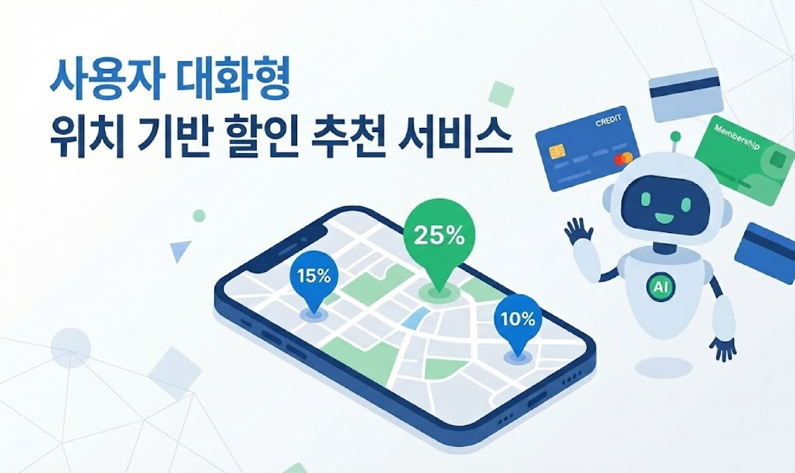
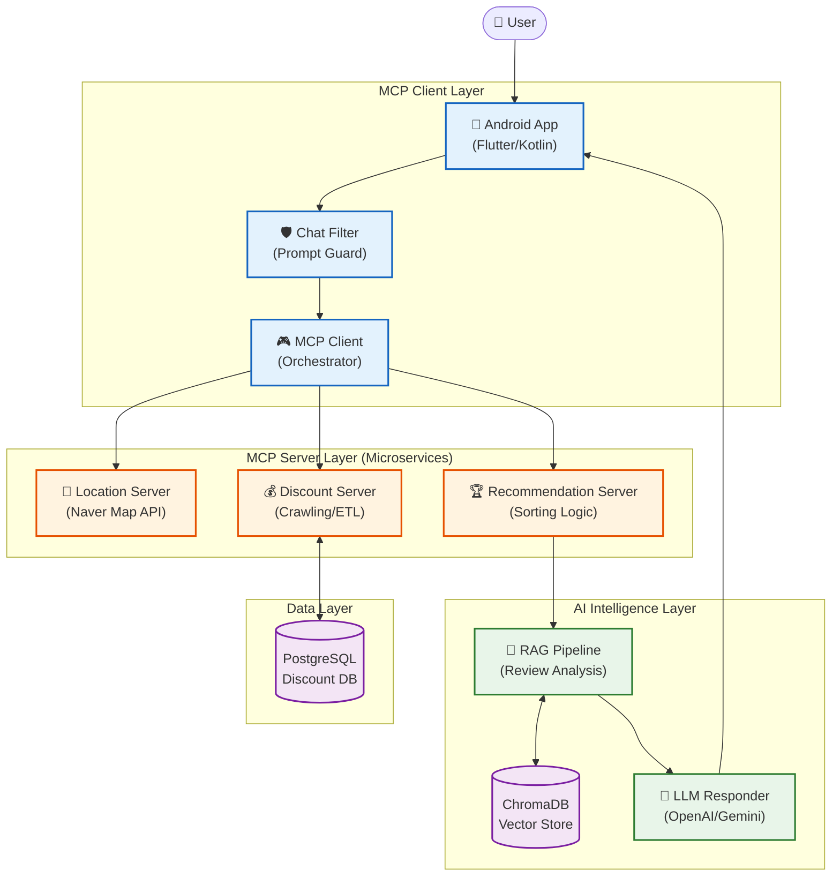

## 👀 데모 & 자료 (추가 예정)

  - 아키텍처 다이어그램: `docs/architecture.png` (TODO)
  - 서비스 플로우/시퀀스: `docs/sequence.png` (TODO)
  - 앱 스크린샷: `docs/screens/` (TODO)
  - 시연 영상: `https://youtu.be/...` (TODO)
  - 제목수정 및 프로젝트 대표 이미지 추가 (TODO)
  - 프로젝트 구조도 (TODO)
  - (시연 영상 대표 이미지)](유튜브 링크)(TODO)
  - 스크린샷 추가 예정 (TODO)
  - 서버 전체 구조도(TODO)
  - 서버 세부 구조도1, 2(TODO)

---

## 👋 팀원 소개

| 이름 | 학과 | 학번 | Email | 담당분야 |
| --- | --- | --- | --- | --- |
| 강동경 | AI융합학부 | 22학번 | kdk2146@dgu.ac.kr | 위치할인, 추천서비스+RAG |
| 고유지 | 컴퓨터AI학부 | 23학번 | goyuji4@gmail.com | UI/UX, 추천서비스+개인화 |
| 박주영 | 컴퓨터공학과 | 22학번 | zoozero910@gmail.com | 추천서비스+위치할인 |
| 서형선 | 컴퓨터AI학부 | 22학번 | 2022113581@dgu.ac.kr | UI/UX, 추천서비스+개인화 |
| 신유진 | 컴퓨터공학과 | 21학번 | tdw0312@gmail.com | 추천서비스+위치할인 |

---

## 🛠️ Tech

### Frameworks

- FastAPI (REST), Android (Kotlin, Naver Maps), MCP client/server, RAG(Gemini + Chroma), OpenAI(GPT)

### Server/Infra

- PostgreSQL, Naver Map API, Linux (Ubuntu)

### Stack/Libs

- Python, Kotlin
- OkHttp/Retrofit, Gson (Android)
- openai, google-generativeai, chromadb, asyncpg, aiohttp

---

## 1. 프로젝트 명

위치 기반 할인 추천 서비스 (TODO)



## 2. 프로젝트 소개

> 현재 할인 정보는 카드사, 통신사, 프랜차이즈별로 분산되어 있어 소비자가 모든 혜택을 인지하고 활용하기 어렵고, '분위기 좋은 카페'와 같이 복잡한 맥락과 의도가 담긴 요구를 충족하는 검색 시스템 또한 부재한 실정이다. 이로 인해 소비자는 자신의 취향에 맞는 장소를 발견하거나 최적의 조건으로 합리적인 소비를 하기가 힘들어 보인다. 따라서, 본 프로젝트는 LLM과의 자연스러운 대화를 통해 사용자의 숨은 의도와 소비 패턴을 분석하여 **개인 맞춤형 F&B 매장을 추천**하고, 흩어진 할인 정보를 종합해 **업장별 최적의 결제 방식을 제안**하는 어플리케이션을 구현하고자 한다.

## 3. 프로젝트 구조도



## 4. 시연 영상 및 구동화면

```markdown

[](유튜브 링크)(TODO)
```

### 스크린 샷

### 1️⃣ 메인 화면

(스크린샷 추가 예정)(TODO)

### 2️⃣ 지도 화면

(스크린샷 추가 예정)

### 3️⃣ 채팅화면

(스크린샷 추가 예정)(TODO)

---

## 5. 서버 전체 구조

서버 전체 구조도(TODO)

## 6. 서버 세부 구조

서버 세부 구조도1(TODO)

서버 세부 구조도2(TODO)

## 🚀 핵심 기능

- **위치·리뷰 수집**: 네이버맵 기반 주변 매장 검색 + 리뷰 크롤링 (`mcp-server/Location_server`).
- **할인 매칭**: 사용자 프로필의 통신사/멤버십/카드/소속 조건을 PostgreSQL 할인 DB와 매칭 (`mcp-server/Discount_MAP_server`).
- **추천 엔진**: 사용자 선호도(가성비/분위기/모임), 거리·할인율 기반 정렬, 프랜차이즈/자영업 필터 (`mcp-server/recommend_server`).
- **LLM/RAG 응답**: Gemini 임베딩 + Chroma로 컨텍스트 구성 후 OpenAI/Gemini로 자연어 답변 (`mcp-client/RAG`, `mcp-client/mcp_client.py`).
- **모바일 앱**: Naver Maps 기반 UI, 프로필 온보딩, 채팅/추천 호출 (`app/src/main/java/com/example/discountapp`).

---

## 🧭 시스템 파이프라인

1. **ChatFilter**: 프롬프트 검증/키워드 추출(Gemini) → `place_type`, `attributes`, `location`.
2. **Location Server**: 네이버맵 API로 매장/거리/리뷰 수집.
3. **Discount Server**: 사용자 프로필 + 매장명으로 적용 가능한 할인 후보 계산(PostgreSQL).
4. **Recommendation Server**: 선호도/거리/할인율 기반 랭킹 + 프랜차이즈 필터.
5. **RAG & LLM**: 추천/리뷰를 임베딩 → 컨텍스트 → OpenAI/Gemini 답변.
6. **App**: 지도/리스트/채팅 UI로 결과 표시.

아키텍처 다이어그램(TODO): `docs/architecture.png`

---

## 📂 리포 구조 요약

- `mcp-client/` : FastAPI + MCP 총괄, ChatFilter, RAG, REST 엔드포인트(`/api/recommend`).
- `mcp-server/Location_server/` : 네이버맵 기반 위치/리뷰 크롤링 서버(MCP).
- `mcp-server/Discount_MAP_server/` : 할인 DB, ETL, MCP 도구 `get_discounts_for_stores`.
- `mcp-server/recommend_server/` : 할인 계산/정렬/프랜차이즈 필터링.

---
